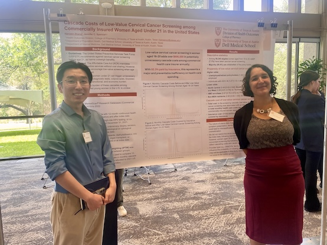

# For Students and Trainees

## Prospective Students or Trainees

Thanks so much for your interest! 

**Research Opportunities** - At this time, I do not have any open research opportunities for undergraduate, graduate, or post-doctoral fellows, but I will update this page when I do. Undergraduates interested in getting involved in research at UT should check out resources [here](https://undergraduates.utexas.edu/academics/undergraduate-research/research-resources/students/ut-research-programs). 

**Mentorship** - If you are looking for a mentor or collaborator on an existing research project, thesis, or dissertation, I currently have capacity to support a few additional projects provided they are aligned with one or more of my primary research themes: **simulation modeling**, **health equity**, or **cancer prevention/screening**.  If this is you - feel free to [reach out](mailto:jennifer_spencer@austin.utexas.edu)!

## Current & Former Students and Trainees

I am very lucky to work with some amazing medical students at the Dell Medical School and with graduate students in multiple colleges at the University of Texas at Austin. 

Here's some of their amazing work: 

    **Select Publications** 

Zhang H*, Charlton BM, Scharrs PW, Trentham-Dietz A, Keuhne F, Siebert U, Shokar NK, Pignone MP Spencer JC. Mammography Screening and Risk Factor Prevalence by Sexual Identity: A Comparison Across Two National Surveys. Cancer. 2025 May; 131 (10); e35852. DOI: https://doi.org/10.1002/cncr.35852 

Spencer JC, Zhang H*, Charlton BM, Scharrs PW, Keuhne F, Siebert U, Trentham-Dietz A, Shokar NK, Jane J. Kim, Pignone MP. Cervical Cancer Screening and Risk Factor Prevalence by Sexual Identity: A Comparison Across Three National Surveys in the United States. Prev Med. 2025 May; 2025 (194) DOI: https://doi.org/10.1016/j.ypmed.2025.108262 

Zhang S*, Patel VR, Spencer JC, Hayes AB, Adamson AS. Racial and Ethnic Differences in the Risk of Second Primary Melanoma. JAMA Derm. 2024 Oct 9. doi:10.1001/jamadermatol.2024.3450. Online ahead of print. 

    **Select Presentations**

Zhang H*, Spencer JC								                              	11/25	
“Overuse of Cervical Cancer Screening Among Women Aged 18 to 21”. 
Livestrong Cancer Retreat, Austin TX

Zhang H*, Spencer JC									                              11/25	
“Overuse of Cervical Cancer Screening Among Women Aged 18 to 21”. 
Dell Med Annual Research Symposium, Austin TX

Lai JH*, Avenceña AL, Barner JC, Park C, Evoy KE, Spencer JC				08/25
“Risk of respiratory and cardiovascular adverse events associated with gabapentinoid 
use among female breast cancer survivors in the United States: A new-user, 
active comparator cohort study”. Oral Presentation. 
International Society for Pharmacoeconomics. Washington, DC. 

Lai JH*, Avenceña AL, Barner JC, Park C, Evoy KE, Spencer JC				05/25
“Impact of Gabapentinoid use on Healthcare Utilization and Expenditure among Female 
Breast Cancer Survivors in the United States: A propensity matched Cohort Study.” 
Poster Presentation. 
International Society for Pharmaceutical and Outcomes Research. Montreal, CA.

Heidari E*, Rascati K, Richards K, Spencer JC, Brown C. 					 05/25
“Colorectal Cancer Screening Initiation Among Newly Age-Eligible Medicaid-Insured 
Individuals in Texas”. Poster Presentation. 
International Society for Pharmaceutical and Outcomes Research. Montreal, CA.

Heidari E*, Rascati K, Richards K, Spencer JC, Brown C. 					05/25
“Colorectal Cancer Screening Initiation Modalities Among Newly Age-Eligible Medicaid 
Insured Individuals in Texas”. Poster Presentation. 
International Society for Pharmaceutical and Outcomes Research. Montreal, CA.

Zhang H*, Charlton BM, Scharrs PW, Trentham-Dietz A, Keuhne F, 	  06/25
Siebert U, 	Shokar NK, Pignone MP, Spencer JC.			
“Mammography Screening and Risk Factor Prevalence by Sexual Identity: A Comparison of 
Two National Surveys”. Oral Presentation.
Society of Epidemiologic Research. Boston, MA 

Zhang H*, Spencer JC								                            	10/24	
“Breast Cancer Screening and Risk Factor Prevalence by Sexual Identity: 
A Comparison of Two National Surveys”. 
MD Anderson/UT Austin Cancer Conference, Austin TX

