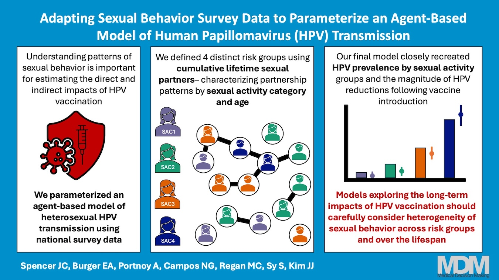

A new paper has been published in *Medical Decision Making*. This study, in collaboration with Dr. Jane Kim and the Harvard cervical cancer modeling team uses data from the National Survey of Family Growth and other sources to re-design a heterosexual transmission model of HPV. This expands on prior work by using a lifetime perspective of HPV risk (defining risk groups using lifetime sexual partnerships rather than past year data). We found our re-parameterized model acurately recreated HPV risk for these same populations using National Health and Nutrition Examination Survey data as well as changes in HPV prevalence over time. Read the full study [here](https://journals.sagepub.com/doi/full/10.1177/0272989X261425681?_gl=1*ari004*_up*MQ..*_ga*NjMyMDA1My4xNzg1MjAzMjQ1*_ga_60R758KFDG*czE3ODUyMDMyNDUkbzEkZzEkdDE3ODUyMDMyNjAkajQ1JGwxJGg4NTY4MjE1MTM.)

<!--more-->
