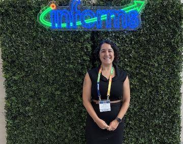

I had the opportunity to present at an invited session titled, "Equity-Informative Health Policy Simulation" at the 2026 INFORMS Healthcare Conference in Raleigh, NC. My presentation built from previously published work on using race-stratified models to understand what process improvements would have the largest impact on reducing racial inequities in cervical cancer.

<!--more-->
