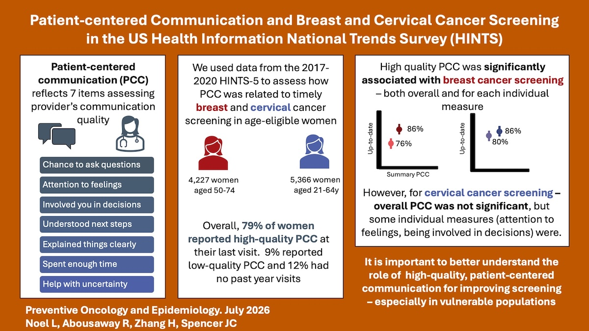

A new paper published in *Preventive Epidemiology & Oncology* and led by Dr. Lailea Noel explores the relationship between reported quality of provider communication over the past year and up-to-date use of cervical and breast cancer screening using data from the NCI's Health Information National Trends (HINTS) study. We found patients reporting high-quality "patient-centered"" communication were more likely to be up-to-date with breast cancer screening, but this relationship was not as strong for cervical cancer screening - with variation by specific measures. You can read the full study [here](https://www.tandfonline.com/doi/full/10.1080/28322134.2026.2710453) 

<!--more-->
